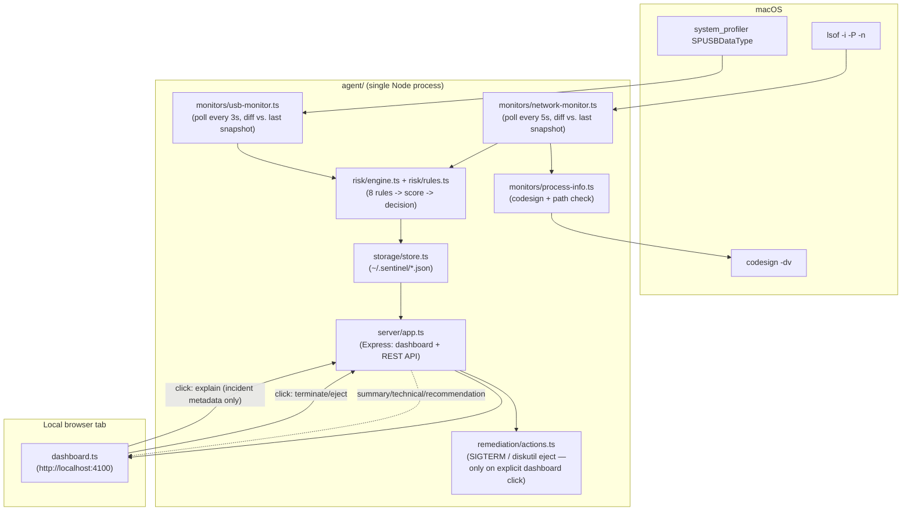

# GhostShield Sentinel Agent — Local Intrusion Detection

A local background daemon that watches real OS-level signals for signs of
intrusion, scores them with Sentinel's transparent rules, and sends only
sanitized incident metadata to AEGIS ForkGuard for counterfactual policy
analysis. On macOS it monitors network connections and USB devices. On
Windows it watches removable storage plus newly attached USB HID/network
devices, requests a Microsoft Defender custom scan for storage, and runs from
the notification area at sign-in. Destructive remediation
still requires explicit confirmation in the command center.

This began as a Chrome-extension prototype that could only see behavior
inside a browser tab. It was rebuilt from the ground up as a real
background agent because a browser extension fundamentally cannot see
what's happening on the rest of the machine — a different technical
domain, not a refactor.

## Project overview

GhostShield polls real OS surfaces on a timer:
- **macOS network connections** (`lsof -i -P -n`) — every established
  connection and open listening port, with the owning process's
  identity, code-signing status, and executable path.
- **macOS USB devices** (`system_profiler SPUSBDataType -json`) — every
  attached device, classified by name into storage / HID (keyboard-
  mouse-class) / network-adapter / other.
- **Windows USB devices** (PowerShell PnP/CIM) — newly attached keyboard/HID
  and USB-network devices are logged; newly mounted storage is also sent to
  Microsoft Defender for a custom scan before Sentinel records the clean,
  unavailable, or threat-found result.
- **AEGIS ForkGuard** (Jac) — evaluates ALLOW, WARN, BLOCK, and CONTAIN
  futures without replacing Sentinel's observable risk score.

Each newly-observed event is scored by an additive, fully transparent
rule engine (same philosophy as the original browser prototype: every
point is traceable to a named rule, no black-box model) and logged
locally. Nothing leaves the machine except an explicit, user-triggered
AI-explanation request.

## Threat model

**In scope:**
- A process connecting to a port historically associated with malware/
  backdoors (either as the outbound destination, or — the stronger
  signal — a local process *listening* on one)
- A process that isn't code-signed at all making network connections
- A process running from a commonly-abused staging location (`/tmp`,
  `/var/tmp`, straight out of `~/Downloads`) making network connections
- A process suddenly opening a new listening port (potential backdoor/
  reverse-shell setup)
- A process contacting many distinct new destinations in quick
  succession (a beaconing/scanning pattern)
- A newly-attached USB device, classified by risk (a USB-network
  adapter — a possible MITM implant — scores highest; storage devices
  and HID devices are scored separately)

**Out of scope for this build** (see Future improvements):
- File-system integrity monitoring (startup items, LaunchAgents/
  LaunchDaemons, system file changes)
- Deep process behavior monitoring beyond "what network connections did
  it make" (e.g. syscall tracing, memory inspection)
- Windows network/process inspection; the Windows MVP currently focuses on
  USB device arrival and delegates removable-storage content scanning to Microsoft Defender
- Shipping a second malware signature database; GhostShield orchestrates the
  platform antivirus rather than pretending AEGIS is itself a signature scanner

**What Sentinel Agent deliberately never collects:** full network
payloads, file contents, keystrokes, or anything beyond connection/
device metadata (process name, path, remote address/port, device name).

## Features

- Transparent detection rules across network + USB + Defender verdicts,
  additive 0–100 scoring, with the same
  three-tier decision model as the original prototype: **allow** (0–39)
  → **warn + log** (40–69) → **action available** (70–100)
- **No automatic actions, ever.** "Blocked" here means "a safe
  remediation exists and is one click away in the dashboard" — not that
  anything already happened. Killing a process or ejecting a drive is
  much higher-stakes than blocking one HTTP request (the original
  browser prototype's ceiling), so this project has no auto-block tier
  at all.
- Real, verified remediation: `SIGTERM` a process (skipped entirely for
  root-owned or known-critical system processes — see
  `isSafeToTerminate`), or `diskutil eject` a USB storage volume
- Desktop command-center dashboard with a five-second live refresh,
  incident timeline, current 15-minute risk score, security alert queue,
  attack history, and category/severity/framework analytics
- Deterministic event correlation that groups repeated activity from the
  same process, destination, device, or web origin inside a ten-minute window
- Potential MITRE ATT&CK and OWASP Top 10:2025 mappings for supported
  behaviors. These are explicitly labeled as behavioral alignments rather
  than proof that an attack technique succeeded
- Incident filters (category/severity/decision/search), expandable details,
  and a guarded clear-history action
- Optional AI-generated plain-English explanations per incident
  (deterministic mock mode by default, live via any OpenAI-compatible
  endpoint)
- AEGIS ForkGuard decision graphs with explicit ALLOW, WARN, BLOCK, and
  CONTAIN branches for each reviewed incident
- Installable as a macOS LaunchAgent or Windows scheduled background task

## Architecture



**Why this had to stop being a browser extension:** every rule in the
original prototype (cross-origin form submission, hidden iframes,
clipboard access) only makes sense *inside a browser tab* — a Chrome
extension has no visibility into what other applications on the machine
are doing, what's connecting to the network outside the browser, or
what's plugged into a USB port. "Detect any intrusions on your laptop"
requires OS-level signals a browser sandbox structurally cannot provide.

## Folder structure

```
project-root/
  agent/
    package.json, tsconfig.json, esbuild.config.mjs
    .env.example
    src/
      index.ts                    # entry point: starts server + both monitor intervals
      shared/{types.ts, constants.ts}
      risk/{rules.ts, engine.ts, engine.test.ts}
      monitors/
        network-monitor.ts        # lsof polling, diffing, evaluation
        usb-monitor.ts             # system_profiler polling, diffing, evaluation
        process-info.ts             # codesign + suspicious-path + isSafeToTerminate
      storage/store.ts              # JSON-file incidents/settings (~/.sentinel/)
      insights/security-insights.ts # alerts, correlation, mappings, history, analytics
      remediation/actions.ts        # terminateProcess, ejectUsbDevice
      server/{app.ts, ai-explanation.ts}
      aegis/{client.ts, process.ts}  # Jac lifecycle and sanitized API bridge
      dashboard/dashboard.ts        # client-side; bundled by esbuild (runs in a real browser)
    aegis/                           # AEGIS ForkGuard Jac graph and tests
    windows/                         # Windows setup, tray, startup, firewall scripts
    public/
      index.html, dashboard.css
      dashboard.js                  # esbuild output, gitignored — run `npm run build:dashboard`
    launchd/com.sentinel.agent.plist.template
    scripts/{install.sh, uninstall.sh}
    demo/trigger-suspicious-connection.sh
  PLAN.md
  README.md
```

## Installation and access

The command center is local-only at **http://127.0.0.1:4100**.

### Windows

Requires Node.js 22+, Python 3.12+, and Microsoft Defender. From the
repository root:

```powershell
powershell.exe -ExecutionPolicy Bypass -File .\agent\windows\Setup-GhostShield.ps1
powershell.exe -ExecutionPolicy Bypass -File .\agent\windows\Install-GhostShieldStartup.ps1
```

Run the second command from an Administrator PowerShell window. It creates a
current-user task, protects the local dashboard/Jac ports with Windows
Firewall, and starts the shield icon. The Jac environment lives at the short
`%LOCALAPPDATA%\GhostShield\venv` path so Windows package installation does not
hit the long-path failure caused by deeply nested repository folders.

Open the command center by double-clicking the shield in the Windows
notification area or visiting **http://127.0.0.1:4100**.

### macOS

Requires Node.js 22+. Jac must be installed and available on `PATH` for AEGIS;
Sentinel continues monitoring if Jac is offline.

```sh
cd agent
npm install
npm run build:dashboard   # bundles the one client-side file the daemon serves
npm start                  # runs in the foreground — Ctrl+C to stop
```

Open **http://127.0.0.1:4100** for the dashboard. The daemon itself
(`src/index.ts` and everything it imports) runs directly via Node's
native TypeScript support — no build step for the daemon, only for the
dashboard's client-side bundle.

### Running in the background permanently (LaunchAgent)

```sh
cd agent
./scripts/install.sh     # starts now, and again automatically at every login
```

Logs land in `agent/logs/agent.log` / `agent.error.log`. To remove:
`./scripts/uninstall.sh` (incident history in `~/.sentinel/` is left
untouched — delete that directory yourself for a full clean slate).

### Environment variables (`agent/.env`, copy from `.env.example`)

| Variable | Default | Purpose |
|---|---|---|
| `SENTINEL_PORT` | `4100` | Dashboard/API port |
| `SENTINEL_HOST` | `127.0.0.1` | Loopback-only dashboard/API bind address |
| `AEGIS_URL` | `http://127.0.0.1:8012` | Local AEGIS ForkGuard service |
| `JAC_EXECUTABLE` | `jac` / installed Windows runtime | Optional explicit Jac executable |
| `OPENAI_API_KEY` | *(unset)* | If unset, AI explanations always use the deterministic mock |
| `OPENAI_MODEL` | `gpt-4o-mini` | Verify against your account's available models |
| `OPENAI_BASE_URL` | `https://api.openai.com/v1` | Any OpenAI-*compatible* endpoint (Groq verified working) |
| `SENTINEL_DATA_DIR` | `~/.sentinel` | Where incident/settings JSON files live |

## Demo instructions

With the agent running (`npm start`, or installed via `install.sh`):

1. **Network — suspicious listening port:**
   ```sh
   ./demo/trigger-suspicious-connection.sh
   ```
   Opens a real (harmless) `nc` listener on port 31337 — a port with a
   long history of malware/backdoor association. Within one poll cycle
   (~5s) this should appear in the dashboard scored **75/100, blocked**,
   citing both `suspicious-port` and `new-listening-port`, with a
   "Terminate process" button that genuinely works (verified live during
   development against a disposable test process).

2. **USB — plug in any USB drive.** Within ~3s it should appear as a
   `usb_storage_device` incident with an "Eject device" button.

3. Open the dashboard, filter by category/severity/decision, expand a
   row for the full rule breakdown, and click **Generate AI
   explanation** on any incident.

## Testing instructions

```sh
cd agent
npm test          # risk-engine tests (17, pure logic — no OS calls)
npm run typecheck # tsc --noEmit
npm run check     # both
```

The monitors themselves (`network-monitor.ts`, `usb-monitor.ts`) are
integration code that shells out to real OS tools — not unit-tested,
verified instead by actually running the daemon (see below). The 17
engine tests cover: normal traffic scoring 0, suspicious-port firing for
*both* outbound connections and local listeners, unsigned-process
detection, suspicious-path detection (with the ad-hoc-signature
combination), unseen-remote-host (with/without context), new-listening-
port (new vs. already-known), the beaconing rule, all 4 USB categories
scoring independently, remediation-safety gating `blocked` vs.
`detected_not_blocked`, score clamping, every threshold boundary, and
that an invalid category throws instead of failing silently.

**This was verified genuinely end-to-end while building it** — not just
unit-tested in isolation:
- Ran the live daemon against this machine's real network traffic and
  found a real false positive: a legitimate Cloudflare `workerd` process
  was flagged because an early version of the suspicious-path rule
  matched *any* dot-prefixed directory in a path, and this machine's own
  project directory happens to live under `~/.superset/...`. Fixed by
  narrowing the rule to genuine staging locations (`/tmp`, `/var/tmp`,
  `~/Downloads`) — see the comment in `shared/constants.ts`.
- Ran the `nc`-on-31337 demo live and confirmed the resulting incident
  scored 75/blocked with the correct PID.
- Called the remediation endpoint against a disposable test process
  (`yes > /dev/null &`) and confirmed it was actually terminated —
  never tested against a real system process, for obvious reasons.
- Confirmed the USB monitor's startup baseline correctly treats
  already-connected devices (built-in keyboard/trackpad) as pre-existing,
  not "newly attached."

## Privacy guarantees

Sentinel Agent never collects: file contents, keystrokes, clipboard
data, or full network payloads. What it stores locally
(`~/.sentinel/incidents.json`, never transmitted anywhere): process
name/path, remote address/port or device name, the computed score and
which named rules fired. The only thing that ever leaves the machine is
that same incident metadata, sent to your configured AI endpoint **only
when you click "Generate AI explanation,"** and only if you've set an
API key — the default mock mode makes zero network calls.

## Known limitations

- **Platform coverage differs.** macOS includes network/process and USB
  metadata monitoring. Windows includes background USB storage and HID/network
  device discovery, Microsoft Defender storage scans, and AEGIS, but not yet
  Windows network telemetry.
- **Visibility is scoped to the current user's session.** Running
  unprivileged, `lsof -i` only shows the current user's own processes —
  this is a real privacy/permission boundary, not a bug, but it also
  means a root-owned malicious process's network activity would not be
  observed at all (and even if it were, remediation deliberately refuses
  to touch it — see `isSafeToTerminate`).
- **USB device classification is name-based**, not the actual USB device
  class code (`system_profiler` doesn't expose that) — a device with a
  misleading name could be misclassified.
- **Process path resolution occasionally returns just the binary name**
  instead of a full path (depends on how `ps -o comm=` resolves a given
  process), which means the suspicious-path rule can't evaluate it —
  observed live with `nc` during the demo run above.
- **No firewall-level blocking.** Terminating the offending process is
  the only network remediation — actually blocking future connections
  at the network layer would require `pfctl` rules and root privileges,
  which a normal login-session LaunchAgent doesn't have. Out of scope for
  this build.
- **Polling, not event-driven.** A connection or device that appears and
  disappears entirely between two poll ticks (5s / 3s) would be missed.

## Future improvements

- File-system integrity monitoring (LaunchAgents/LaunchDaemons, login
  items) — the other major intrusion-detection signal category not yet
  built
- Event-driven USB monitoring (IOKit notifications) instead of polling
- A signed allowlist of known-good processes/vendor IDs to reduce
  false-positive review burden over time
- `pf` firewall integration for actual network-layer blocking (requires
  a privileged helper — a real scope increase, not a quick add)
- Linux support (`ss`/`netlink`) and Windows network telemetry
  (`Get-NetTCPConnection`/ETW)

## Team split

**Person 1 — Agent core & OS integration**
`monitors/network-monitor.ts`, `monitors/usb-monitor.ts`,
`monitors/process-info.ts`, the LaunchAgent install/uninstall scripts.

**Person 2 — Detection & remediation**
`risk/rules.ts`, `risk/engine.ts`, `remediation/actions.ts` (and its
safety gating), the risk-engine test suite, the demo script.

**Person 3 — Dashboard, backend API & presentation**
`server/app.ts`, `server/ai-explanation.ts`, `dashboard/dashboard.ts`,
visual polish, demo/pitch preparation.
