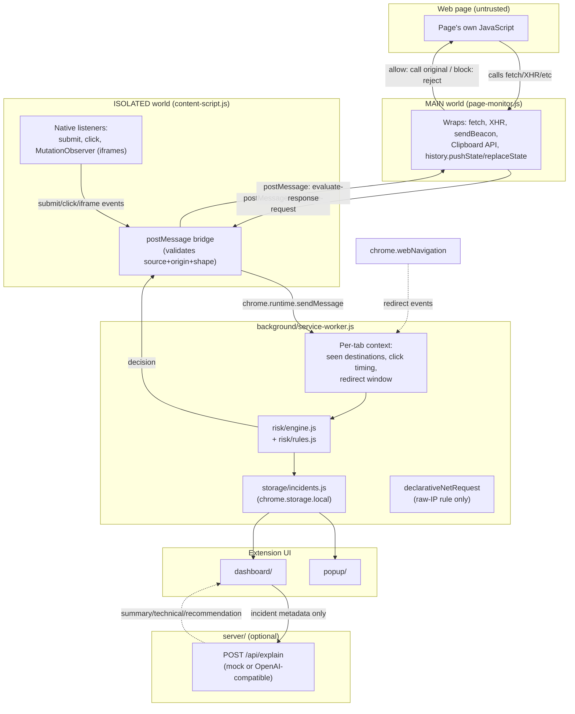

# Sentinel — Runtime Threat Guardian

A Chrome MV3 extension that watches how a webpage *behaves* after it
loads — not just what domain it's on — scores that behavior against a
transparent, local rule engine, and blocks or warns before the risky
action completes wherever that's technically possible. An optional local
server can turn a logged incident's rule findings into a plain-English
explanation.

Built to a strict 1–2 day hackathon scope: **a reliable end-to-end demo
over broad feature coverage.** Every blocking claim in this project was
checked against what Manifest V3 actually allows before being built —
see [MV3 limitations](#manifest-v3-limitations).

## Project overview

Most browser security tools work off blacklists: known-bad domains, known
malware signatures. Sentinel instead watches *behavior* — a form quietly
posting a password to a different origin, a page phoning home to a raw IP
address, a hidden iframe appearing out of nowhere — and scores it locally,
with zero backend dependency for the core detection loop.

## Threat model

**In scope** (things a malicious or compromised page might do that
Sentinel is built to catch):
- Exfiltrating form data (especially credentials) to a different origin
- Sending unusually large payloads via `fetch`/XHR/`sendBeacon`
- Using `sendBeacon` for fire-and-forget background exfiltration
- Contacting a destination expressed as a raw IP rather than a domain
- Injecting a hidden iframe
- Redirecting the page immediately after a user click (bait-and-switch)
- Chaining several redirects in quick succession
- Reading or writing the clipboard without an obvious user-facing reason
- Contacting a destination the page has never talked to before
- Using URL paths that look like tracking/collection endpoints

**Out of scope** (explicitly not attempted):
- Detecting malware *content* (this isn't antivirus — it has no file
  scanning, no signature database)
- Protecting against attacks that don't touch any instrumented browser
  API (e.g. a purely visual phishing page with no suspicious network/DOM
  behavior — that class of threat needs a different detector, not this one)
- Anything server-side; Sentinel only ever sees what happens inside the
  tab

**What Sentinel deliberately never collects:** password values, cookies,
auth tokens, full request bodies, or raw form field contents. Only
metadata — origins, approximate sizes, method, event type — is ever
stored or transmitted. See [Privacy guarantees](#privacy-guarantees).

## Features

- Real-time detection across 8 behavior categories (see rule list below)
- A transparent, additive 0–100 risk score — every point is traceable to
  a named rule, not a black-box model
- Three-tier decision: **allow** (0–39) → **warn + log** (40–69) →
  **block when technically possible, otherwise detect + log** (70–100)
- Actual prevention for what CAN be reliably prevented: form submissions,
  async fetch/XHR, and Clipboard API calls
- Honest "detected but not blocked" labeling for what can't be
  (`sendBeacon`, redirects, SPA history changes, hidden iframes)
- One real `declarativeNetRequest` rule for the one case that's a genuine
  static-pattern fit: raw-IP sub-resource requests
- Local incident log (`chrome.storage.local`) — nothing leaves the
  browser unless you explicitly click "Generate AI explanation"
- Popup: live protection status, today's counts, last 3 incidents,
  protection/AI toggles
- Dashboard: summary cards, a filterable incident table (severity /
  decision / event type / domain), expandable per-incident detail, a
  guarded clear-history action
- Optional Express server for AI-generated explanations, with a
  deterministic mock mode that needs no API key at all

## Architecture



**Why two content-script worlds?** MV3 content scripts run in an
**ISOLATED** world by default — they share the page's DOM but have their
own separate JS globals. Patching `window.fetch` from there does **not**
intercept the page's own calls to `fetch`, because each world has its own
copy of the mutable global object. Actually observing what the page does
requires injecting into the page's **MAIN** world (`"world": "MAIN"` in
`manifest.json`, Chrome 111+). MAIN-world scripts have no `chrome.*` API
access, so decisions bridge back to the isolated world via a validated
`window.postMessage` round trip.

## Folder structure

```
project-root/
  extension/
    manifest.json
    background/
      service-worker.js       # canonical risk evaluation, storage, badge, DNR rule
    content/
      content-script.js       # ISOLATED world: bridge + native DOM listeners
      page-monitor.js         # MAIN world: fetch/XHR/sendBeacon/clipboard/history hooks
    risk/
      rules.js                # 11 pure, independently-testable detection rules
      engine.js                # scoring + decision + incident builder
      engine.test.js           # Node built-in test runner
    storage/
      incidents.js             # chrome.storage.local read/write/query
    popup/
      popup.html / .css / .js
    dashboard/
      dashboard.html / .css / .js
    shared/
      constants.js             # rule weights, thresholds, enums — single source of truth
      utils.js                 # origin/IP parsing, id/timestamp helpers
    public/icons/
  server/
    package.json
    src/
      app.js
      routes/explain.js
      services/ai-explanation.js
      middleware/error-handler.js
    .env.example
  demo/
    safe-test.html
    suspicious-test.html
    redirect-test.html
  PLAN.md
  README.md
```

## Installation

### 1. Extension (no build step — vanilla JS, load directly)

1. Open `chrome://extensions`
2. Enable **Developer mode** (top-right toggle)
3. Click **Load unpacked** → select the `extension/` directory
4. Sentinel's shield icon appears in the toolbar; click it for the popup

The extension is **fully functional with no backend running** — only the
"Generate AI explanation" button in the dashboard needs the server.

### 2. Backend (optional — only needed for AI explanations)

```sh
cd server
npm install
cp .env.example .env      # leave OPENAI_API_KEY blank for mock mode
npm start                  # listens on http://localhost:4000
```

**Environment variables** (`server/.env`):

| Variable | Default | Purpose |
|---|---|---|
| `PORT` | `4000` | Server port |
| `OPENAI_API_KEY` | *(unset)* | If unset, `/api/explain` always returns the deterministic mock explanation |
| `OPENAI_MODEL` | `gpt-4o-mini` | Verify against your account's available models — naming changes over time |
| `OPENAI_BASE_URL` | `https://api.openai.com/v1` | Point at any OpenAI-*compatible* chat-completions endpoint |

The demo pages are also served by this same server, under `/demo/*.html`
(see below) — one `npm start` gets you both.

## Demo instructions

With the server running (`cd server && npm start`) and the extension
loaded:

1. Open `http://localhost:4000/demo/safe-test.html` — submit the form,
   watch the popup badge. Expect **no incidents, score 0**.
2. Open `http://localhost:4000/demo/suspicious-test.html` — try each
   numbered button in order:
   - **#1 password form** → should be **blocked** (an in-page interstitial
     appears with a risk score and a "Continue anyway" override)
   - **#2–6** (large payload, beacon, hidden iframe, clipboard, raw IP) →
     each logs an incident with mid-to-high severity
3. Open `http://localhost:4000/demo/redirect-test.html` — click "Simulate
   click + rapid redirects". Expect a **medium/high** score marked
   `detected_not_blocked` (redirects can't be reliably cancelled — see
   below), not `blocked`.
4. Click the toolbar icon → **Open dashboard** to see every incident,
   filter by severity/decision/event type/domain, expand a row for the
   full rule breakdown, and click **Generate AI explanation** on any row.

All three demo pages carry a visible on-page banner and are entirely
self-contained fixtures — see the [Privacy guarantees](#privacy-guarantees)
section for exactly what does and doesn't leave the browser.

## Testing instructions

```sh
cd extension
npm test
```

Runs Node's built-in test runner (`node --test`) against
`risk/engine.test.js` — 15 tests covering: safe same-origin GET, cross-
origin POST, large payload, password-form-to-another-origin (and that
it's marked `blocked`), raw IP destination, multiple rules accumulating
additively, score clamping at 100, every threshold boundary
(0/39/40/69/70/100), non-blockable event types correctly landing on
`detected_not_blocked` instead of `blocked`, redirect-after-click (with
and without context), unseen-destination (with and without a
`seenDestinations` set), missing optional fields *not* throwing, invalid
event types *throwing*, and that `buildIncident()` never carries a
sensitive-data key.

No server-side tests are included — the Express layer is thin
(validation + a mock/live explanation call) and was verified manually via
`curl` during development (see Phase 4 notes in the build log / `PLAN.md`).

## Manifest V3 limitations

This was checked deliberately, not assumed — **do not treat any of the
below as solved by `declarativeNetRequest` alone**:

| Behavior | Can MV3 block it? | What Sentinel does |
|---|---|---|
| Form submission | Yes — native `submit` event, `preventDefault()` holds it | Actually blocked; resumes via `form.submit()` (doesn't re-fire the listener) |
| Async `fetch` | Yes — already returns a Promise, gating it doesn't break the page's control flow | Actually blocked (rejected promise) |
| Async XHR | Yes — same reasoning, callback-based | Actually blocked (delays the real `.send()` until a decision arrives) |
| **Synchronous** XHR (`async: false`) | No — delaying it would freeze the page | Detected and logged only, **never** claimed as blocked |
| Clipboard API | Yes — promise-based | Actually blocked (rejected promise) |
| `navigator.sendBeacon` | **No** — the whole point of the API is a synchronous, fire-and-forget call with no way to defer or cancel it after invocation | Detected and logged only |
| Top-level redirects / navigation | **No** — MV3 removed reliable blocking `webRequest` for navigation; there is no supported way to cancel an in-progress top-level navigation from an extension | Detected via `webNavigation.onCommitted`, logged, marked `detected_not_blocked` |
| `history.pushState`/`replaceState` (SPA nav) | **No**, not without risking breaking the page's own routing | Detected and logged only |
| Hidden iframe | Partial — by the time a `MutationObserver` callback fires, the browser may have already started loading the iframe's `src` | Detected and logged; not promised to be prevented |
| `declarativeNetRequest` for dynamic, JS-scored blocking | **No** — DNR only matches static URL patterns; it cannot react to a runtime-computed score | Used for exactly one static-pattern-appropriate case: raw-IP sub-resource requests (see below) |

**Why the raw-IP `declarativeNetRequest` rule is scoped to sub-resources
only:** a user directly navigating to an IP address (a home router at
`192.168.1.1`, say) is completely normal and must not be blocked. A
*page's own background request* to a raw IP is the actual suspicious
pattern this extension targets, so the rule's `resourceTypes` excludes
`main_frame`.

## Privacy guarantees

Sentinel never collects, stores, or transmits:
- Password values or any form field's actual contents
- Cookies or authorization headers
- Full request/response bodies
- Raw clipboard contents (only *that* a clipboard read/write was
  attempted, not the text itself)

What it does store locally (`chrome.storage.local`, never leaves the
browser except via an explicit "Generate AI explanation" click): page
origin, destination origin, event type, HTTP method, an **approximate**
byte size (computed and immediately discarded — the value itself is never
kept), the computed score/severity/decision, and the named rules that
fired. `risk/engine.test.js` includes an explicit test asserting the
incident object never carries a `password`/`cookie`/`token`/
`authorization`/`formData`/`rawBody`/`value` key.

The only thing that ever leaves the machine is the same incident metadata
above, sent to `/api/explain` **only when the user clicks that button**,
and only if you've configured a real backend — the mock mode (default)
makes zero network calls at all.

## Known limitations

- Per-tab detection context (seen destinations, click timing, redirect
  window) is held in-memory in the service worker. MV3 can terminate and
  restart service workers between events, which resets this context —
  already-logged incidents are unaffected (they're durably in
  `chrome.storage.local`), but a rule that depends on cross-event memory
  (e.g. "unseen destination") may occasionally under-fire right after a
  service-worker restart.
- Blocking a request that already left the wrapper before a decision
  arrived isn't possible — the async-gated categories (fetch/XHR/
  clipboard) have a ~3-second fail-open timeout so a bridge hiccup can
  never hang the page; in the rare case that fires, the action proceeds
  (fail-open by design, logged either way).
- The "large payload" and "suspicious path" thresholds are static
  constants (`shared/constants.js`), not adaptive — a legitimate large
  upload to a same-origin endpoint won't be flagged (no cross-origin
  rule), but a legitimate large cross-origin upload could be.
- No test coverage for the Express server beyond manual `curl` checks
  during development.
- No persistence beyond `chrome.storage.local`'s quota; very heavy
  browsing could eventually hit the `MAX_STORED_INCIDENTS` cap (500),
  which just drops the oldest incidents.

## Future improvements

- Adaptive/contextual thresholds instead of static constants
- Server-side incident aggregation across multiple installs/users
- A signed, versioned rule-update mechanism (ship new detection rules
  without a full extension update)
- Session-persisted tab context (`chrome.storage.session`) so a service-
  worker restart doesn't reset detection memory
- Real integration tests for the Express server
- An options page for per-rule weight tuning (currently requires editing
  `shared/constants.js` directly — intentionally, to keep the MVP simple)

## Team split

**Person 1 — Extension core**
Manifest, background service worker, Chrome APIs (`webNavigation`,
`declarativeNetRequest`, `storage`, `tabs`), the block/warn/allow
enforcement workflow.

**Person 2 — Detection**
Page instrumentation (`page-monitor.js`, `content-script.js`), the risk
engine (`risk/rules.js`, `risk/engine.js`), the demo attack pages, and
the risk-engine test suite.

**Person 3 — UI + backend + presentation**
Popup, dashboard, the Express explanation API, visual polish, and demo/
pitch preparation.
